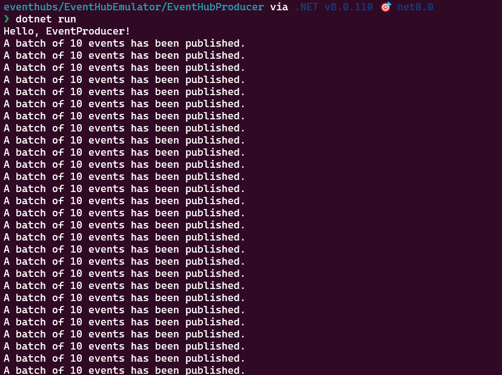
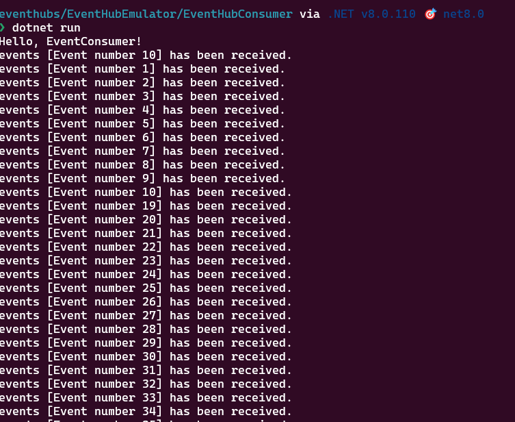
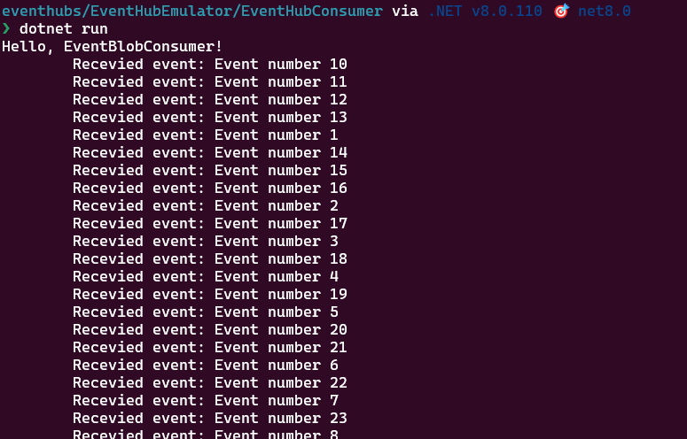

## Exploration of Azure Event Hub Emulator

# Preprequises 
- Docker
- NET SDK 8

# LOCAL SETUP
- Using any command line (Powershell, bash, ...)
- From the folder "docker-compose" run `docker-compose run -d` to setup the emulator
- The docker will setup azurite too the storage account emulator
- All the settings are located in EventHubShared

# PROJECTS
- The project "EventHubProducer" produces 10 messages every seconds

- The project "EventHubConsumer" contains two consumers
    - EventConsumer : Consumes all messages at realtime and will always start from the begining

    - EventBlobConsumer : Consume message from a partition and will not consume again
    
